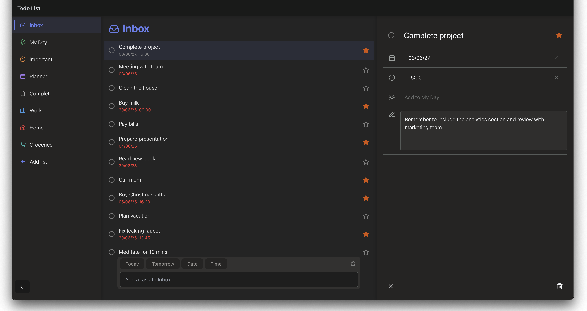

# 📝 ToDo List Web Application



A modern, responsive To-Do List application with a sleek interface for optimal task management. Organize your life with customizable lists, priority markers, and deadline tracking. The interface is inspired by popular productivity tools and is optimized for both desktop and mobile devices.

## ✨ Key Features

- 🗂️ **Multi-list Organization**
  - Create unlimited lists (Work, Home, Shopping, etc.)
  - Customize with icons and colors
- ✅ **Task Management**
  - Mark tasks as important ⭐ or completed ✔️
  - Set due dates 📅 and times ⏰
  - Add detailed notes 📝
- 📱 **Fully Responsive**
  - Optimized for all devices
  - Mobile-first design
- 🎨 **Modern UI**
  - Dark/Light mode support
- ⚡ **Performance Optimized**
  - Fast loading with Vite
  - Smooth animations

## 🛠️ Tech Stack

| Technology                                                                                                          | Purpose            |
| ------------------------------------------------------------------------------------------------------------------- | ------------------ |
|                  | Frontend framework |
|                     | Build tool         |
|  | CSS framework      |
|     | Icon library       |
| React DatePicker                                                                                                    | Date/time picker   |

## 🚀 Getting Started

### Prerequisites

- Node.js v16+
- npm v7+ or yarn

### Installation

1. Clone the repository

```bash
git clone https://github.com/yourusername/Portfolio-ToDoList.git
cd Portfolio-ToDoList
```

2. Install dependencies

```bash
npm install
```

### Running the App

```bash
npm run dev
```

Open [http://localhost:5173](http://localhost:5173) to view the app in your browser.

## 📄 License

This project is licensed under the MIT License.
